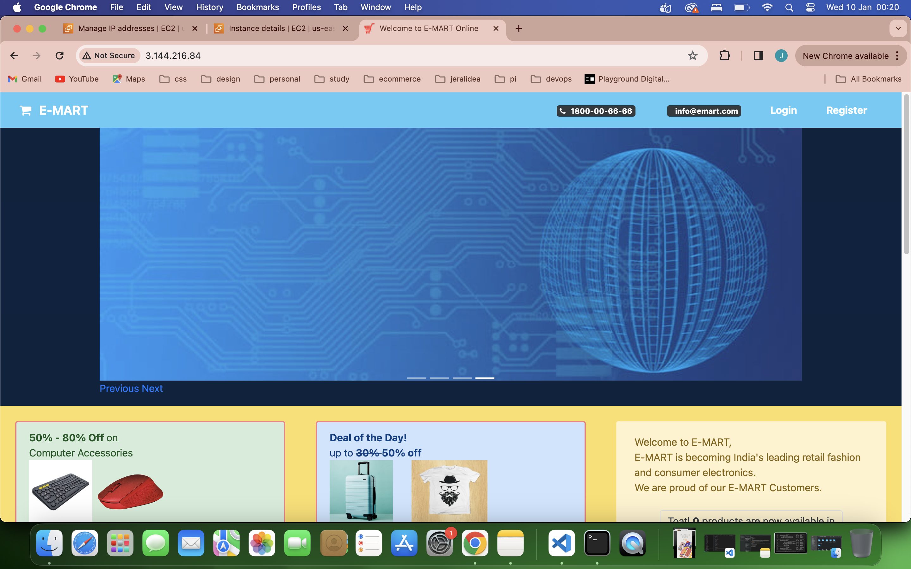
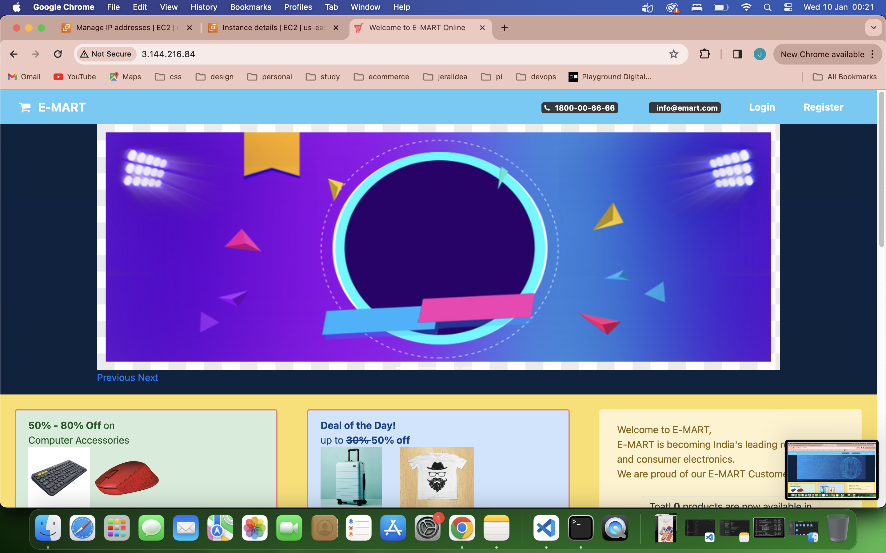
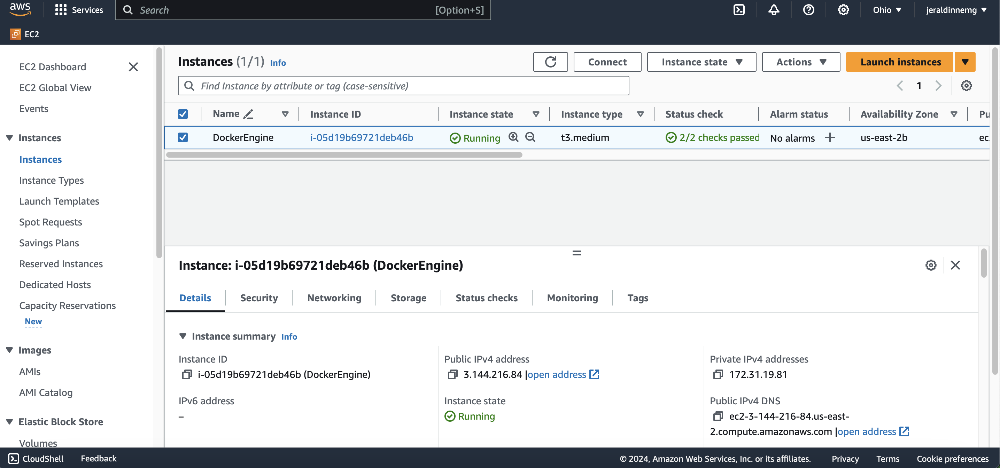
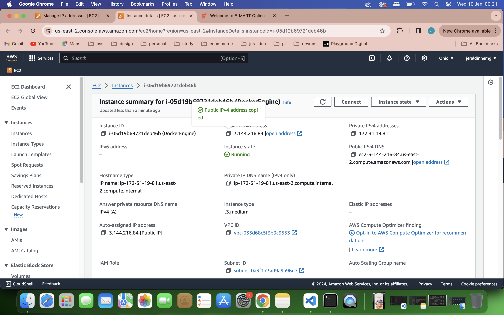
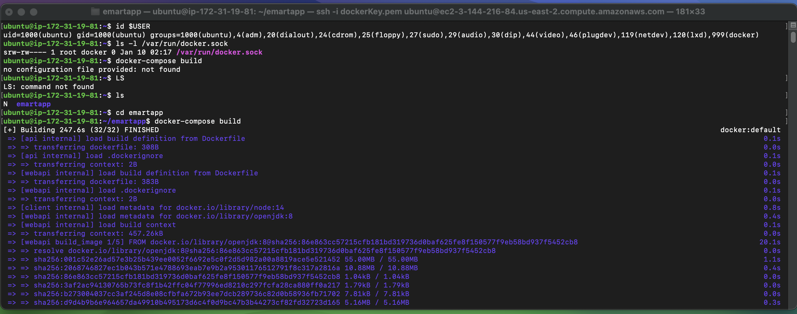
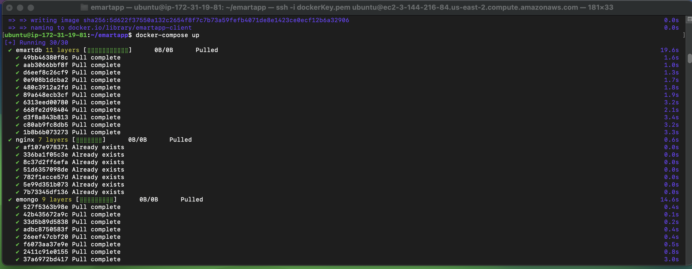
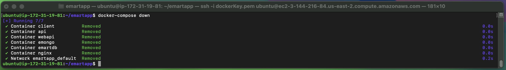

# emart-app

# Containerization of Java application using Docker and AWS 🐳+ 🟧

### About:
How you containerize micro service stack?
In this project I have gone through the docker file, docker compose file and nginx configuration. When you are containerizing, you first need to create the docker file for your customized image. 
In this repo we have three docker files and the nginx configuration for our Nginx container, which is the API gateway and finally the Docker compose file.

### Tools:
- 👩🏽‍💻 Docker (Container Runtime / Environment).
- 👩🏽‍💻 MicroService Stack (Emartapp: nginx, angular, NodeJs, Java. MongoDB, MySQL)
- 👩🏽‍💻 AWS EC2

## Deployment emarapp using docker and aws

